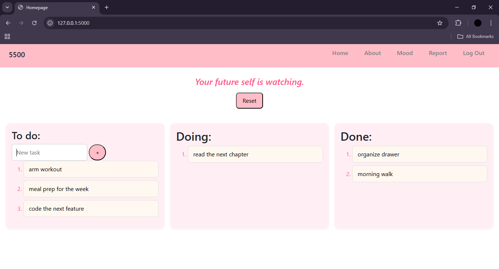

# CS50 Final Project: Task Management Web App

#### Video Demo: <submit50 cs50/problems/2026/x/project>

A minimalist task management web app that uses a point-based system to gamify productivity and unlock additional features.

#### Description:

Users can register and log in to manage their tasks and track progress through points. Tasks are added to a to-do column and can be moved to doing and done by a single click. Each task done adds 100 points, encouraging consistency through small wins. As users gain points more features are unlocked. At 500 points users unlock a mood based task recommendation feature which suggests tasks based on how the user is feeling. At 1000 points users unlock a productivity report that displays their productivity percentage. The app is intentionally designed to be minimalist in order to avoid overwhelm and reduce procrastination. By focusing on simple task states and gradual rewards the app helps users build momentum and maintain consistent productivity over time.

#### File structure:
- app.py: Main Flask app containing routes, authentication logic, database queries, and actions logic.
- templates/: Contains all HTML templates rendered by Flask using Jinja.
- static/: Contains CSS file for styling the application.
- requirements.txt: Contains dependencies to be installed
- database.db: Sqlite database file

#### Motivation and design philosophy:
Productivity apps often have too many tabs sections, options, styles, layouts, categories and similar features which can be overwhelming for users. This web app is intentionally kept minimalist to avoid that sense of overwhelm and bring clarity. Task management is kept simple and clean because managing tasks can already be quite overwhelming and chaotic. 
In addition points are there to motivate the users. This app is intentionally built around small wins in favour of our dopamine system. Unlocking features can help users to keep going and even after unlocking watching the points keep increasing can be satisfying and even motivating. Moreover the productivity report is another way to track progress and wanting consistent good reports may also help users to get things done.
However the most important thing is to stay true to yourself and only mark tasks done when they are actually done.

#### App experience:
Users can register to get an account then they can login and of course logout if they wish. 
After logging in users are directed to the homepage where they can see a motivating quote at the very top and below it a clean simple tasks section. Users can type the tasks in to do and then move them to doing and done by one simple click. Each done task adds 100 points. These tasks have states in the database as well on the basis of which they are managed. The reset button will delete all tasks.
The users may navigate to other pages which are about mood and report.
The about section goes to the depth of how to use the app and the core of why it is built the way it is.
The mood page unlocks at 500 points and enables the users to select tasks based on their current mood. 
The report page which unlocks at 1000 points shows users how productive they have been from the point they added their first task in to do. 
The best practice is to do a daily reset at the end of the day however users may choose to do it weekly or even monthly.

#### Backend implementation:
Flask is the core of this app because it is simple, lightweight and beginner friendly. Perfect for a small app like this. 
Sessions are used to track users also because of simplicity and consistency on multiple devices. All data is user specific. Each user has their own points and tasks. 
Task states have been used instead of multiple tables for to-do, doing and done tasks to avoid complexity and excess storage space occupation. The tasks are displayed by conditionally querying the database.
Productivity score is calculated based on current tasks and their states. This makes the app very flexible users can decide when exactly do they want to see their progress and patterns be it daily weekly monthly or even every few hours.
Sqlite database has been chosen because it goes very well with python (flask) and is lightweight and fast as well. 

#### Frontend design:
For frontend vanilla html and css with jinja templates and bootstrap has been used. 
UI is also kept intentionally minimalist to avoid clutter and overwhelm. The AI assisted code has been explicitly mentioned in the code comments.

#### Database design :
The database has a users table which has their id, username, password hash (not password for security reasons) and points. 
A tasks table which has id, user_id which references users table id, status, timestamp (for future scalling to calculate procrastination based on for how long were the tasks in to-do), and the actual task. 
The last table is quotes table which simply has id and quotes for displaying quotes on the homepage. Points are stored in users table because they are user specific and tasks are made user specific because the tasks table has user_id from users table. 

#### Limitations and scalability
This web app is currently very simple but future scalability may be:
- Drag and drop instead of clicking on tasks to change states
- Analytics graph, in detail reports of productivity and procrastination patterns and user input (like journalling) on why they think they were productive or not. These insights may be used in the report.
- Mood logic is currently simple conditional logic but it may become ai integrated chatbot style 
- Instead of just points for gamification streaks can be added 
- Tiny tips and suggestions can be added for important actions

#### Features:

- User authentication system with registration and login
- To-Do, Doing, and Done states for tasks
- Point-based reward system
- Productivity report
- Mood selection for tasks
- Motivational quotes

